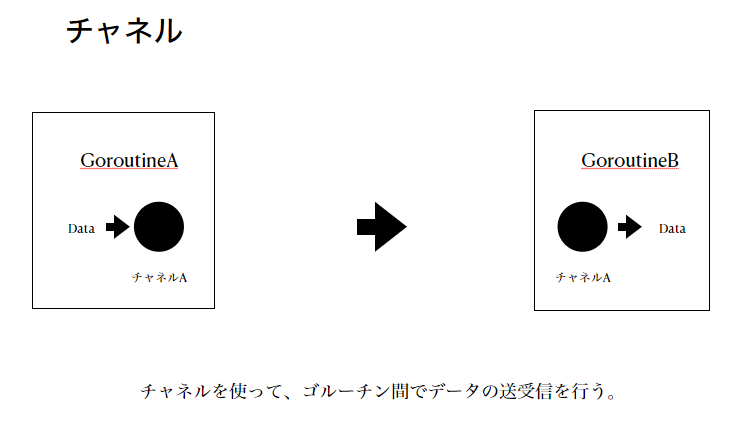

# Golang基礎
## 変数
1. 明示的な定義
  - **var 変数名 型 = 値**
  - 関数の外でも使用可能。
  - 基本的にはこっちの方が型がわかりやすいのでこっちを使う。
  ```go
  // 基本
  var i int     = 2
  var s string  = "Hello"
  var t, f bool = true, false
  ```

  ```go
  // まとめて定義する 
  var (
    i int = 2
    s = string = "Hello"
  )
  ```

  ```go
  // 宣言のみ
  var i int
  var s string
  ```
  
2. 暗黙的な定義
  - **変数名 := 値**
  - 関数の外では使用不可
  ```go
  i := 2
  s := "Hello"
  t, f := true, false
  ```
<br>
<br>

## 基本型
### 配列
後から要素数を変更することができない。

#### 定義
```go
// 要素数3の配列arrayを定義。初期値は [0,0,0]。
var array [3]int
```

```go
// 要素数3の配列arrayを定義。初期値は [1,2,3]。
var array [3]int = [3]int{1,2,3}
```

```go
// 要素数3の配列arrayを定義。初期値は [A,B,(空文字)]。
var array [3]string = [3]string{"A", "B"}
```

```go
// 配列arrayを暗黙定義。初期値は [1,2,3]。
array := [3]int{1, 2, 3}
```
```go
// 配列arrayを定義。初期値は [A,B]。
array := [...]string{"A", "B"}
```
<br>

### interface型
- 全ての型と互換性がある。
- 初期値としてnilを持つ。
- 演算ができない。
```go
// 定義
var x interface{}

// あらゆる型を代入できる。
x = 1
x = "A"
x = [3]int{1,2,3}
```
<br>

### 型変換
#### 文字列型?数値型
```go 
var s string = "100"

//変換
i, err := strconv.Atoi(s)

//エラーハンドリング(正常なら err = nil で帰ってくる )
if err != nil{

}
```
#### 数値型?文字列型
```go
var i int = 1

// 変換
s := strconv.Itoa(i)

```
#### 文字列?バイト配列
```go
var s1 string = "Hello"

// バイト配列へ変換
b := []byte(s1)

// 文字列に変換
s2 := string(b)
```
<br>
<br>

## 定数
```go
// 定数の定義。関数の外で定義する。
const Pi = 3.14

// 複数の定数を定義
const (
  URL = "http://xxxx.co.jp"
  SiteName = "test"
)

// 複数の定数を定義するとき、値を省略して代入することが可能
const (
  A = 1
  B /* 1が入っている */
  C /* 1が入っている */
  D = "A"
  E /* Aが入っている */
)

// 連続する整数の連番を生成する
const (
  c0 = iota
  c1
  c2
)
func main(){
}
```
<br>
<br>

## 関数
### 基本
```go
// 返り値が一つ
func Plus(x int, y int) int {
  return x + y
}

// 返り値が複数。引数が同じ型なら以下のように省略して書ける。
func Div(x,y int) (int, int) {
  q := x / y
  r := x % y
  return q, r
}

// 返り値の変数を指定
func Double(price int) (result int) {
  result = price * 2
  return // returnの後を省略できる
}

// 返り値がない変数
func Noreturn() {
  fmt.Println("Hello")
  return
}
```
### 無名関数
```go
func main () {
  // fという変数に無名関数を定義
  f := func (x,y int) int {
    return x + y
  }

  // fという変数に入った無名関数で演算 
  i := f(1,2)
}
```

```go
func main () {
  // fという変数を使わずにそのまま処理することも可能。
  i := func (x,y int) int {
    return x + y
  }(1,2)
}
```
### 関数を返す関数
```go
// 返り値がfunc()
func ReturnFunc() func() {
  // 無名関数を返す
  return func() {
    fmt.Println("Hello")
  }
}

func main () {
  // 変数fに関数を登録
  f := ReturnFunc()

  // 実行
  f()
}
```
### 関数を引数にとる関数
```go 
func CallFunction( f func() ) {
  f()
}

func main () {
  // 無名関数を引数にとる
  CallFunction( func() {
      fmt.Println("Hello")
  })
}
```
### クロージャー
Goの無名関数はクロージャーで
クロージャー（関数閉包）とは、関数と関数の処理に関する関数外の環境をセットして閉じ込めたもの。

https://artgear.hatenablog.com/entry/20120115/1326635158

```go
func Later() func(string) string {
  var store string
  return func(next string) string {
    s := store
    store = next
    return s
  }
}

func main () {
  f := Later()
  fmt.Println(f("Hello"))
}
```
### ジェネレーター
何らかのルールに従って連続した値を返し続ける仕組みのこと

```go
// クロージャーを使ってジェネレーターを作ることができる
func intergers() func() int {
  i := 0
  return func() int {
    i++
    return i
  }
}
```
<br>
<br>

## 制御構文
### if文

参考 : 簡易文付きif文 
https://code-database.com/knowledges/97

```go
func main () {
  
  /* 基本 */
  a := 0
  if a == 2 {

  } else if a == 1 {

  } else {

  }

  /* 簡易文付きif文 */
  /* if 簡易文; 条件式 */
  if b := 100; b == 100 {
      println(b)
      /* 100が出力される */
  }
  println(b)
  /* 未定義(0)が出力される */
}
```
### エラーハンドリング

```go
var s string = "100"

i, err := strcomv.Atoi(s)
if err {
  fmt.Prinfln(err)
}
```
### for
```go
/* 無限loop */ 
for {

}
```

```go
i := 0
for i < 10{
  i++
}
```

```go
for i := 0 ; i < 10 ; i++ {

}
```

```go
// 配列の中身を取り出す
arr := [3]int{1,2,3}
for i := 0 ; i < len(arr) ; i++ {
  fmt.Println(arr[i])
}
```
```go
// 範囲for文で配列の番号と要素を取り出す
arr := [3]int{1,2,3}
for i, v := range arr {
  fmt.Println(i, v)
}
```
```go
// 範囲for文で配列の番号を取り出す
arr := [3]int{1,2,3}
for i := range arr {
  fmt.Println(i)
}
```
```go
// 範囲for文で配列の要素を取り出す
arr := [3]int{1,2,3}
for _, v := range arr {
  fmt.Println(v)
}
```

```go
// スライスも配列と同様にrangeで取り出せる
sl := []string{"Python", "PHP", "GO"}
for i, v := range sl {
  fmt.Println(i,v)
}
```

```go
// マップも配列と同様にrangeで取り出せる
m := map[string]int{"apple":100, "banana":200}
for k,v := range m {
  fmt.Println(k,v)
}
```

### switch 式スイッチ
```go
/* これが基本。case 1,2で複数値を指定できるのが便利なところ。 */
n := 2

switch n {
  case 1,2:
    fmt.Println("1 or 2")
  case 3,4:
    fmt.Println("3 or 4")
  default:
    fmt.Println("other")
}
```
```go
/* nをswitch文の中で定義できる。この方が局所性を高めることができる。 */
switch n:=2; n {
  case 1,2:
    fmt.Println("1 or 2")
  case 3,4:
    fmt.Println("3 or 4")
  default:
    fmt.Println("other")
}
```

```go
/* caseの判定は条件式を書くことができる。 */
/* ただし条件式と値をcase同じswitch文の中に混在させることはできない。 */
switch n:=2; n {
  case n > 0 && n < 4:
    fmt.Println("0 < n < 4")
  case n > 3 && n < 9:
    fmt.Println("3 < n < 9")
  default:
    fmt.Println("other")
}
```
### switch 型スイッチ
```go
func anything (a interface{}) {
  fmt.Println(a)
}   

func main () {
  anything("aa")
  anything(1)

  var x interface{} = 3
  // 型アサーション 変数.(復元したい型)
  i := x.(int)
  fmt.Println(i+2)

  // これはエラー。計算することができない。
  // fmt.Println(x+2)


  /* xは3で定義しているので、型アサーションできずに強制終了する。 */
  f := x.(float64)
  
  /* こうすると、強制終了せずにすむ。fには0、isFloat64にはFalseが返ってくる */
  f, isFloat64 := x.(float64)

  /* これを利用するとif文でこんなことができる */
  if x == nil {
    fmt.Println("None")
  } else if i, isInt := x.(int) ; isInt {

  } else if s, isString := x.(string) ; isString {

  } else {

  }

  switch x.(type) {
    
  case int:

  case string:

  default:
  
  }
  
  switch v := x.(type) {
    
  case bool:

  case string:

  default:
  
  }

}
```
## 参照型
### スライス
```go
//宣言。配列と比べると要素数を書かない
var sl []int
```
```go
// 明示的な宣言
var sl []int = []int{100,200}
```
```go
// 暗黙的な宣言
sl := []string{"A", "B"}
```

```go
//第二引数に要素数を入れる
sl := make([]int, 5)

// [0 0 0 0 0]が生成される
```

```go
// 値の更新
sl[0] = 1000
```

```go
// 値の取り出し
sl :=[]int{1,2,3,4,5}

// 0番目を取り出す
sl[0]

// ２番目から４番目まで全て取り出す[3 4]
sl[2:4]

// ２番目まで全て取り出す[1 2]
sl[:2]

// ２番目以降全て取り出す [3 4 5]
sl[2:]

//配列の全てが取り出せる. [1 2 3 4 5]
sl[:]

// 最後を取り出す 5
sl[len(sl) - 1]

// 最初と最後以外を取り出すw[2 3 4]
sl[1 : len(sl) - 1]
```

### スライス　append make len cap
#### append
```go
sl := int{100,200} 
// 要素を拡張 [100,200,300となる]
sl = append(sl, 300)
// 要素を複数渡すこともできる[100, 200, 300, 400, 500, 600, 700]となる
sl = append(sl, 400, 500, 600, 700)
```
#### make
```go
// 要素数5のスライスを生成
sl := make([]int, 5)
```

```go
// 要素数5, 容量10のスライスを生成
sl := make([]int, 5, 10)

// プログラムのメモリを気にする場合は、 容量を決めておく。
// スライスの容量を超えて要素を入れてしまうと、自動的に容量が２倍になり
// 過剰にメモリを確保してしまうと実行速度が落ちたりする。
```

#### len, cap 
```go
// スライスの容量を取得
cap(sl)

// スライスの長さを取得
len(sl)
```

### スライス copy
```go
sl := []int{1,2}
// こうしてしまうと...,sl[0]が書き換えられてしまう
sl2 := sl
sl2[0] = 10000
```

```go
sl1 := []int{1,2}
sl2 := make([]int, 5, 10)

// 返り値はコピーに成功した要素数
n := copy(sl2, sl1)
```

### スライス for
```go
sl := []string{"A", "B", "C"}
//配列と同様にrangeで取り出せる
for i, v := range sl {
  fmt.Println(i, v) 
}

//もちろん古典的forでも可能
for i := 0 ; i < 10 ; i++ {
  fmt.Println(sl[i]) 
}
```

### 可変長引数
```go
// 引数がスライスのように扱える->可変長引数を持つ関数が簡単に作ることができる。
func Sum(s ...int) int {
  n := 0
  for _, v := range s {
    n += v
  }
  return n
}

func main () {
  fmt, Println(Sum(1,2,3))

  /* 引数を好きなだけ伸ばせる */
  fmt, Println(Sum(1,2,3,4,5,6,7,8,9))

  /* 引数をスライスで与えてもOK */
  sl := []int{1,2,3}
  fmtPrint(Sum(sl...))
}
```
### マップ
Rubyでいう**ハッシュ**
Pythonでいう**辞書**
Javascriptでいう**オブジェクト**
```go
// map[キー型名]バリュー型名{ キー : バリュー ,キー : バリュー ,キー : バリュー ...}
var m = map[string]int{"A" : 100, "B" : 200, "C":300}

//マップの取り出し マップ変数名[キー]
fmt.Prinln(m["A"])
```

```go

//空マップの生成
m = make(map[int]string)

//マップの登録
m[1]="JAPAN"
m[2]="CHINA"

//マップの取り出し
fmt.Prinln(m[1])

//マップが取り出せなかった時のエラーハンドリング
//okにはfalseが入っている
s, ok := m[3]

if !ok {
  fmt.Println("error!")
}

//マップの削除
delete(m, 3)

//マップfor
for k, v := range m {
  fmt.Println(k,v)
}
```

配列、スライス、マップの範囲for文

```go
arr = [3]int{1,2,3}
sl := []int{1,2,3}
var m := map[int]string{
  1 : "JAPAN",
  2 : "CHINA",
  3 : "USA"
}

for i, v := range arr {
  fmt.Println(i,v)
}

for i, v := range sl {
  fmt.Println(i,v)
}

for k,v := range m {  
  fmt.Pringln(k,v)
}
```
### チャネル


複数のゴルーチン間でデータを受け渡しをするために設計されたデータ構造

#### 宣言
```go
// チャネルの宣言
var ch chan int

// 受信専用のチャネルの宣言
var ch_rev<-chan int

// 送信専用のチャネルの宣言
var ch_snd chan<- int
```

#### 初期化
```go
// 初期化を行って、書き込み、読み込みができるようにする
var ch chan int
ch = make(chan int)
```
```go
// 直接make関数を使って、宣言&初期化をすることができる
ch := make(chan int)
```

```go
//チャネルの容量を指定して初期化
ch := make(chan int, 5)
```

#### データ送受信
チャネルの仕組みはFIFOになっている.
```go
// 1というデータをチャネルchに送信
ch <- 1
ch <- 2
ch <- 3

// データを受信
fmt.Println(len(ch)) //3
fmt.Println(<-ch)    //1を受信

fmt.Println(len(ch)) //2
fmt.Println(<-ch)    //2を受信

fmt.Println(len(ch)) //1
fmt.Println(<-ch)    //3を受信

fmt.Println(len(ch)) //0
```
チャネルの容量を超えて送信してしまった場合、デッドロックとなってしまう。
```go
var ch := make(chan int, 3)

ch <- 1
ch <- 2
ch <- 3
ch <- 4
// デッドロック！！！
```
#### チャネルとゴルーチン
```go
func receiver( c chan int){
  for{
    i := <-c
    fmt.Println(i)
  }
}

// ゴルーチンを並列処理で
func main() {
  ch1 := make(chan int)
  ch2 := make(chan int)
  
  go receiver (ch1)
  go receiver (ch2)
  
  i := 0
  fot i < 100 {
      ch1 <- i
      ch2 <- i
      time.Sleep(50*time.Millisecond)
      i++
  }
}
```

#### チャネルclose
チャネルをクローズして送信ができないように変更することができる。
ただし受信はできる。
```go
ch := make(chan int)

//1を送信
ch<-1

//チャネルをクローズ。以降、このチャネルへの送信不可となる。
close (ch)

//データ受信をする時に、エラーハンドリングでチャネルが閉じられているかどうかを見ることができる。
// iには1, okにはfalseが入る。
i, ok := <-ch
```

```go
func receiver(name string, chan int){
  for{
      i, ok := <-ch

      //closeされたら抜ける
      if !ok {
        break;
      }
      fmt.Println(name, i)
  }

  //ゴルーチンの終了
  fmt.Println(name + END)
}

func main () {

  // ゴルーチンを3つ起動させる。
  go receiver("1.go routin", ch)
  go receiver("2.go routin", ch)
  go receiver("3.go routin", ch)

  i := 0
  for i < 100 {
    ch <- i
    i++
  }
  close(ch)
}
```

#### チャネルfor
```go
ch := make(chan int, 3)
ch <- 1
ch <- 2
ch <- 3

// forで値を受信する時はcloseしないとデッドロックしてしまう。
close (ch)
for i := range ch {
  fmt.Println(i)
}

```

#### チャネルselect
https://qiita.com/najeira/items/71a0bcd079c9066347b4

```go
//チャネルに値が入っていない時はブロックする。
select {
  case v := <-ch:
    fmt.Println(v)
  default:
    fmt.Println("No Value!")
}
```
closeされているとブロックせずに`case v:= <-ch`が実行される。  
受信かcloseか区別したい場合は以下のようにする。
```go
select{
  case v, ok := <-ch:
    if ok {
      fmt.Println(v)
    }else{
      fmt.Println("closed")
    }
  default:
    fmt.Println("no value")
}

```
## 構造体
### struct
```go
//構造体を定義
type User struct {
  Name string
  Age int
}

func main () {
  var user1 User
  user1.Name = "Nakama"
  user1.Age = 33

  user2 := User{}
  user2.Name = "Nakama"
  user2.Age = 33

  //初期値を設定
  user3 := User{Name: "Nakama", Age: 33}

  //初期値を設定 変数名を省略することができる
  user4 := User{"Nakama", 33}
}
```
```go
// 構造体は参照渡しをすることが多い
func UpdateUser( user *User ){
  User.Name = "Nakama"
  User.Age = 33
}

func main () {
  user := &User{}
  UpdateUser(user)
}
```

### struct メソッド
```go
type User struct {
  Name string
  Age int
}

func (u User) SayName(){
  fmt.Println()
}

func (u *User) SetName(name string){
  u.Name = name
}

func main () {
  user1 := User{Name : Nakama}
  user1.SayName()
  user1.SetName("Nakama")
}
```
### struct 埋め込み
```go
type t struct{
  User User
}

type User struct{
  Name string
  Age int
}
func (u *User) SetName(name string) {
  u.Name = name
}

func main(){
  t := t{User:User{Name:Nakama, Age:33}}
  t.User.SetName("A")
}
```

```go
//型名を省略できる
type t struct{
  User
}

type User struct{
  Name string
  Age int
}

func (u *User) SetName(name string) {
  u.Name = name
}

func main(){
  t := t{User:User{Name:Nakama, Age:33}}

  //省略した場合はUserを書かない
  t.SetName("A")
}
```

### struct型コンストラクタ
https://golangstart.com/constructor/
```go
type User struct {
  Name string
  Age int
}

func NewUser(name string, age int) *User{
  return &User{Name: name, Age: age}
}

func main () {
  user1 := NewUser("Nakama", 33)
}
```
### struct スライス
```go
type User struct {
  Name string
  Age int
}

type Users []*User

func main () {
  user0 := User{Name: "user0", Age: 10}
  user1 := User{Name: "user1", Age: 10}
  user2 := User{Name: "user2", Age: 10}
  user3 := User{Name: "user3", Age: 10}

  users := Users{}

  users = append(users, user0, user1, user2, user3)
}
```

